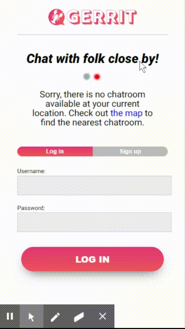
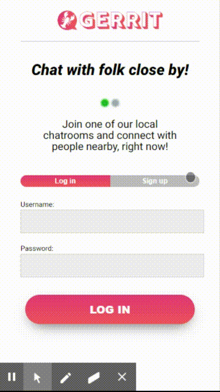
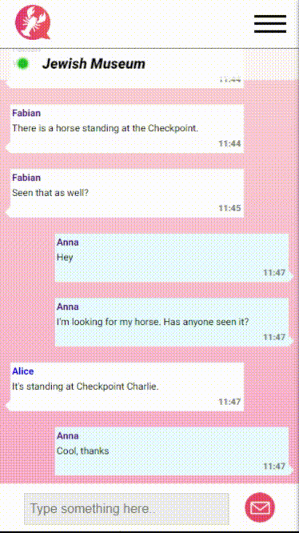
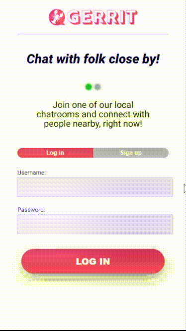

# Gerrit – Chat with people nearby! (3rd Bootcamp Project - Week 9)

For our final project as web development students at Ironhack Berlin we created a mobile web application. We decided to build a chat platform with predefined chatrooms that are only open to users in the same approximate geolocation. In other words: It lets you chat to randoms close by.

To check our deployed version, follow this link: https://justgerrit.herokuapp.com

## Getting started

### Prerequisites

The required packages should be installed by running the following commands:

in the root:

```
npm install
npm install bootstrap react-bootstrap socket.io
npm install heroku-ssl-redirect
node bin/seed
```

in the client folder:

```
npm install
npm install --save passport-local passport bcryptjs  express-session
npm install react-router-dom axios react-map-gl
```

### Testing

To test the code run the following commands:

in the root

```
npm run dev
```

in the client folder:

```
npm start
```

## Features
- Authentication
- Geographically restrained chatrooms
- User profiles
- Interactive Map

When a user enters the page, her geolocation is requested. It is then checked, if the user is located in one of six pre-defined geographical quadrants, which cover most of Berlin's Kreuzberg neighbourhood. If the user is outside of these quadrants a message is shown. The user can scroll down to check out an interactive map and her owwn location to see where the next chatroom is located. If the user is located in one of these quadrants, she will be able to enter a chatroom, in which she can chat with everyone else who is in the same quadrant. It is possible to edit the user profile (image and text) and to check out the other users' profiles by clicking on their names in the chatroom.

### Visual Overview
**User is outside of the geographical boundaries:**


**User is inside of geographical boundaries and uses the chat:**


**User checks a profile of another user and edits her own profile:**


**User checks her position on the map:**


### Basic technical logic

**Geolocation:** To check if a user is located within the geographical boundaries of a chatroom, the browser's geolocation feature is made use of when the App component is mounted. Longitude and latitude are then compared with the cornerpoints of the rectangular spatial areas that represent the chatrooms which are stored in a database (MongoDB). The user's geolocation is updated when it changes.

**Chat:** To enable a real-time chat, a websocket (Socket.io) is used. When a user posts a message, it is stored in the database, together with the geographical origin of its sender. Then, Socket informs all clients, that there is a new message. The clients then query the database for new messages from their same geographical area and get them displayed. Storing the messages in the database allows to display a history of older messages for users the newly enter a chatroom.

## Stack
**Backend**: Node, Express, MongoDB
**Frontend**: React (HTML & CSS)
**Libraries and APIs**: Socket.io, Passport, Mapbox

## Authors

- **Fabian Scherer** - [github](https://github.com/fabianschu)
- **Are W. Sandvik** - [github](https://github.com/arews)
- **Noam Rubin** - [github](https://github.com/noamrubin22)

## Acknowledgments

- Ironhack Berlin
- Montasar Jarraya (our teacher)
- Pierre Portal (TA)
- André de Albuquerque (TA)
- Dalina Weidinger (TA)
- Svenja Maria Katharina Weiler (TA)
